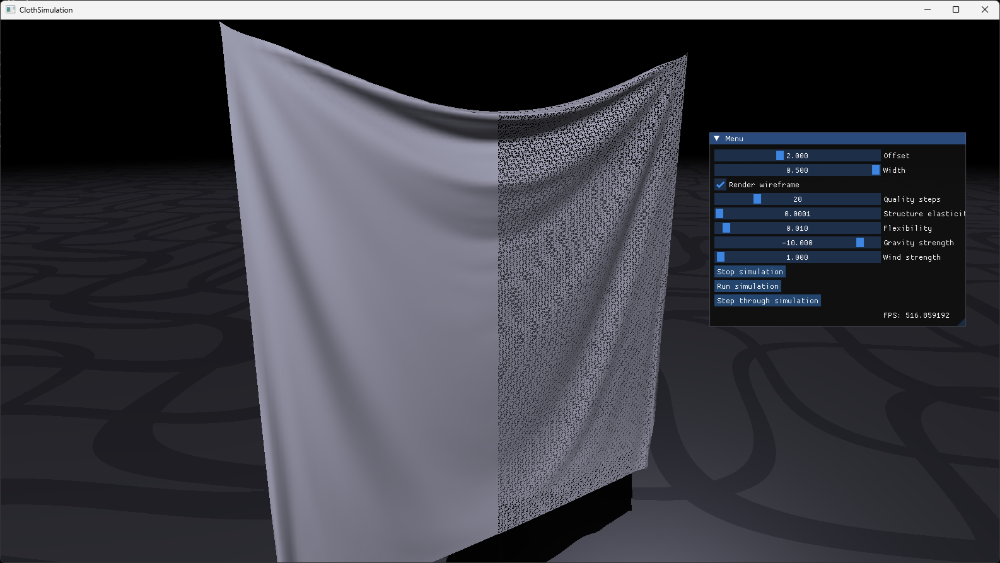

# XPBD Cloth Simulation

Cloth simulation based on XPBD paper.
Made with:
- C++
- DirectX
- ImGui

Stretching constraints are solved using graph colouring with typical Gauss-Seidel method, while sheer and bending constraints are solved using Jacobi method.

Steering:
- Press mouse wheel to rotate around the centre.
- Scroll to zoom in/out

YouTube video: https://www.youtube.com/watch?v=psMpRK0Np5k


<p align="center">Result at 16k vertices (2 ss' glued together).</p>

Building from source:
1. Ensure that your windows machine has developer mode enabled.
2. Install visual studio.
3. Install C++ for windows desktop app development
4. Install C++ for games development from Visual Studio Installer
5. Generate the project using CMake: ```cmake -B buil```
6. Go to ```build``` folder and open .sln file.
7. Select correct startup project
8. Build it using VS.
