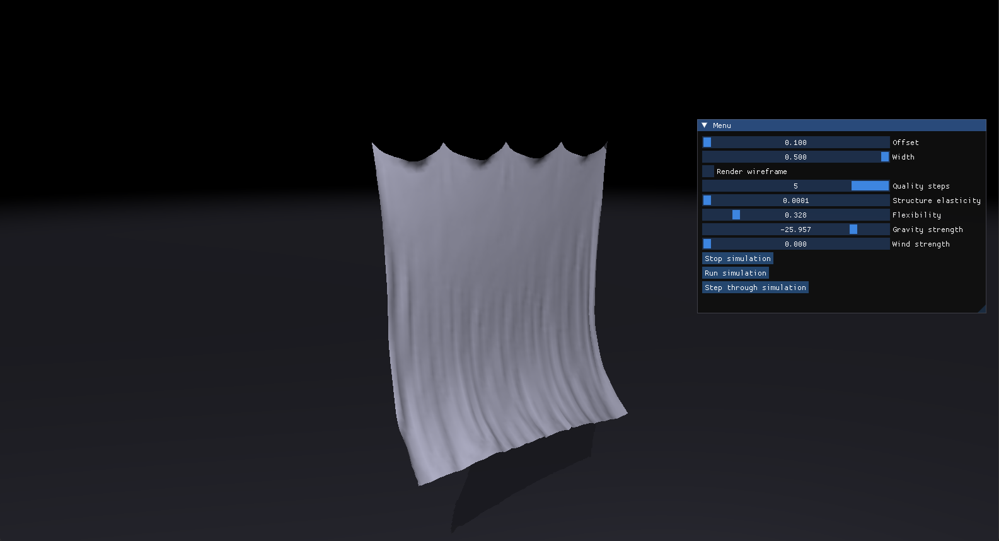
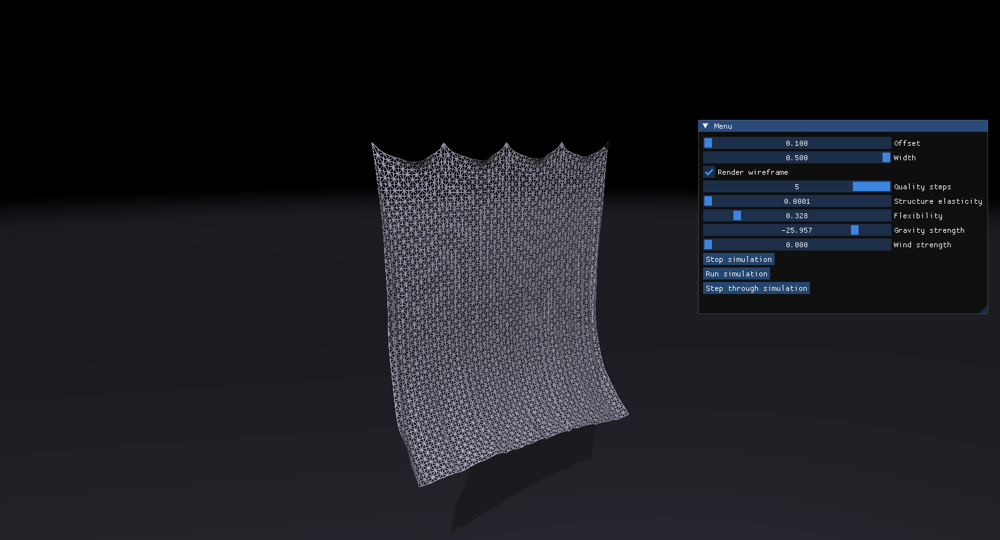

# XPBD Cloth Simulation

Cloth simulation based on XPBD paper.
Made with:
- C++
- DirectX
- ImGui

Stretching constraints are solved using graph colouring with typical Gauss-Seidel method, while sheer and bending constraints are solved using Jacobi method.

Steering:
- Press mouse wheel to rotate around the centre.
- Scroll to zoom in/out

YouTube video: https://www.youtube.com/watch?v=psMpRK0Np5k

Solid mode.

Wireframe mode.
